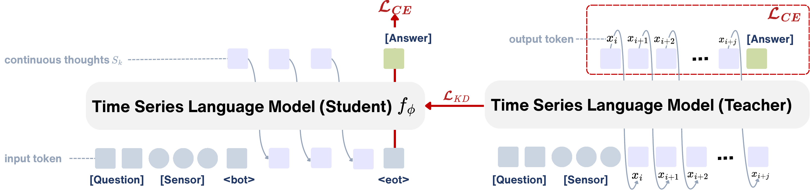

## &nbsp; Lapras: Latent Reasoning for Time Series Language Models

<!-- TODO(release): authors, affiliations, arXiv link -->
<p align="center">
  <a href="<ARXIV_URL>"></a>
  <a href="https://huggingface.co/datasets/leochen085/Lapras-Reasoning-Datasets"></a>
  <a href="https://huggingface.co/leochen085/Lapras"></a>
</p>

<p align="center"></p>

**Lapras** (**La**tent **P**ost-trained **R**easoning **A**cross **S**eries) is a post-training framework that
equips time series language models (TSLMs) with latent reasoning. A model trained with Lapras reasons through a
sequence of *continuous thoughts* in the joint time series–language space, producing text only for the final
answer. It learns this through teacher–student self-distillation from reference chain-of-thought (CoT) traces.

This repository trains and evaluates Lapras and the CoT baseline on three TSLM backbones (ChatTS-8B,
OpenTSLM-1B, SLIP-1B) and five time series question answering benchmarks (ECG, Sleep, HAR, TSR, Engine).

## News

- **[2026]** Code release, with the [datasets](https://huggingface.co/datasets/leochen085/Lapras-Reasoning-Datasets)
  and [Lapras checkpoints](https://huggingface.co/leochen085/Lapras) on HuggingFace.

## Contents

- [Installation](#installation)
- [Data](#data)
- [Models](#models)
- [Evaluation](#evaluation)
- [Training](#training)
- [Repository structure](#repository-structure)
- [Citation](#citation)

## Installation

```bash
git clone https://github.com/yuc0805/Lapras.git
cd Lapras
conda create -n lapras python=3.11 -y
conda activate lapras
pip install torch==2.9.1 --index-url https://download.pytorch.org/whl/cu128   # match your CUDA version
pip install -r requirements.txt
pip install -e .
```

Log in to HuggingFace and W&B:

```bash
huggingface-cli login   # SLIP loads the config of the gated meta-llama/Llama-3.2-1B: accept its license first
wandb login             # training logs to the W&B project `lapras` (set WANDB_PROJECT to change it)
                        # no account: export WANDB_MODE=offline  (or disabled)
```

Optional: run the CPU unit tests.

```bash
pip install pytest
pytest tests
```

## Data

```bash
huggingface-cli download leochen085/Lapras-Reasoning-Datasets --repo-type dataset --include "*.jsonl" --local-dir dataset
```

```
dataset/
├── dataset_info.json   # registers the files for training (part of this repository)
├── ecg/      train.jsonl  test.jsonl  train_with_ts_tags.jsonl  test_with_ts_tags.jsonl
├── sleep/    ...
├── har/      ...
├── tsr/      ...
└── engine/   ...
```

| Dataset | Task | Train | Test | Channels | Length | Answer |
|---|---|---:|---:|---:|---:|---|
| `ecg` | cardiological diagnosis | 5,800 | 643 | 12 | 1000 | `Yes` / `No` |
| `sleep` | sleep-stage classification | 7,413 | 923 | 1 | 1500 | `Wake`, `Non-REM stage 1`, `Non-REM stage 2`, `Non-REM stage 3`, `REM sleep` |
| `har` | human activity recognition | 68,542 | 8,222 | 3 | 128 | `biking`, `lying`, `running`, `sitting`, `standing`, `walking`, `walking_down`, `walking_up` |
| `tsr` | counterfactual consequence prediction | 22,566 | 4,094 | 1 | 128–1020 | option letter + text (`A`–`D`) |
| `engine` | aero-engine fault diagnosis | 2,305 | 193 | 33 | 600 | option letter + text (`A`–`D`) |

One line of a `.jsonl` file:

```json
{
  "input": "You are given a 30-second EEG time series segment. Your task is to classify the sleep stage ...",
  "timeseries": [[0.12, -0.03, ...]],
  "output": "<|bot|> ... reasoning step ... <|eot|> ... <|bot|> ... <|eot|>\nAnswer: Wake"
}
```

- `timeseries`: one list of floats per channel.
- `output`: the reference reasoning trace, then `Answer: <label>` (the marker is the dataset's `answer_anchor`
  in `dataset_info.json`).
- `*_with_ts_tags.jsonl`: the same examples with one `<ts><ts/>` placeholder per channel in the prompt, read by
  ChatTS and OpenTSLM; SLIP reads the plain files.

More in [`dataset/README.md`](dataset/README.md).

## Models

| `model_name` | Backbone | Time series enters the LM through | Base model (train) | Lapras checkpoints (evaluate) |
|---|---|---|---|---|
| `chatts` | ChatTS-8B (Qwen3-8B) | patch embeddings in the token sequence | [`bytedance-research/ChatTS-8B`](https://huggingface.co/bytedance-research/ChatTS-8B) | [`leochen085/Lapras`](https://huggingface.co/leochen085/Lapras) `chatts/` |
| `opentslm` | OpenTSLM-1B (Flamingo, Llama-3.2-1B) | gated cross-attention over a Perceiver resampler | [`OpenTSLM/llama-3.2-1b-sleep-flamingo`](https://huggingface.co/OpenTSLM/llama-3.2-1b-sleep-flamingo) | [`leochen085/Lapras`](https://huggingface.co/leochen085/Lapras) `opentslm/` |
| `slip` | SLIP-1B (Llama-3.2-1B) | cross-attention in the last layers | [`leochen085/SLIP-Llama`](https://huggingface.co/leochen085/SLIP-Llama) | [`leochen085/Lapras`](https://huggingface.co/leochen085/Lapras) `slip/` |

```bash
# base TSLMs, to train -> ckpt/base/<model_name>
huggingface-cli download bytedance-research/ChatTS-8B --local-dir ckpt/base/chatts
huggingface-cli download leochen085/SLIP-Llama --local-dir ckpt/base/slip
cp lapras/backbones/chatts/*.py ckpt/base/chatts/   # the upstream repos ship their own modeling code
cp lapras/backbones/slip/*.py ckpt/base/slip/

# Lapras checkpoints, to evaluate -> ckpt/<model_name>/lapras_<dataset>
huggingface-cli download leochen085/Lapras --include "chatts/*" "opentslm/*" "slip/*" --local-dir ckpt   # all 15 (128 GB)
huggingface-cli download leochen085/Lapras --include "slip/*" --local-dir ckpt                           # one backbone
huggingface-cli download leochen085/Lapras --include "slip/lapras_tsr/*" --local-dir ckpt                # one checkpoint
```

A checkpoint folder:

```
ckpt/slip/lapras_tsr/
├── config.json, weights, tokenizer, modeling code
├── lapras_projection.safetensors   # latent projection π
└── lapras_run_config.json          # K, prompt template, patch size: read by evaluate.py
```

See [`ckpt/README.md`](ckpt/README.md) for details.

## Evaluation

Evaluate the released Lapras checkpoints on TSR, one command per backbone (GPUs 0–3):

```bash
bash script/eval.sh
```

Each command in [`script/eval.sh`](script/eval.sh):

```bash
CUDA_VISIBLE_DEVICES=0,1,2,3 torchrun --nproc_per_node 4 --master_port 29500 evaluation/evaluate.py \
  --ckpt ckpt/slip/lapras_tsr \
  --test_file dataset/tsr/test.jsonl \
  --batch_size 8 \
  --max_new_tokens 512
```

Common changes:

```bash
# another backbone / dataset (ChatTS and OpenTSLM read *_with_ts_tags.jsonl)
--ckpt ckpt/chatts/lapras_ecg --test_file dataset/ecg/test_with_ts_tags.jsonl

# another number of continuous thoughts at inference
--num_latent 3

# a single GPU
python evaluation/evaluate.py --ckpt ckpt/slip/lapras_tsr --test_file dataset/tsr/test.jsonl
```

Results go to `<ckpt>/eval/` (or `--output_dir`):

```
ckpt/slip/lapras_tsr/eval/
├── predictions.jsonl   # per example: idx, gt_label, pred_label, correct, pred_text
└── summary.json        # accuracy, macro_f1, per_class_accuracy, ...
```

## Training

One script per (backbone, method, dataset) trains the model, then evaluates it on the test set:

```bash
bash script/<model_name>/<ft_method>_<dataset>.sh

bash script/slip/lapras_ecg.sh   # SLIP-1B, Lapras, ECG
bash script/chatts/cot_tsr.sh    # ChatTS-8B, CoT baseline, TSR
```

| | values |
|---|---|
| `model_name` | `chatts`, `opentslm`, `slip` |
| `ft_method` | `cot`, `lapras` |
| `dataset` | `ecg`, `sleep`, `har`, `tsr`, `engine` |

Every hyperparameter is written out in the script. The method is set by its last flags, e.g. in
[`script/slip/lapras_ecg.sh`](script/slip/lapras_ecg.sh):

```bash
  --stage lapras \
  --lapras_num_latent 6 \
  --lapras_distill_weight 10 \
  --lapras_teacher_weight 1.0 \
  --lapras_mask_ratio 0.3
```

and `--stage sft --use_cot True` for the CoT baseline.

| Lapras argument | | Default |
|---|---|---|
| `--lapras_num_latent` | number of continuous thoughts *K* | `6` |
| `--lapras_distill_weight` | distillation weight λ | `10.0` |
| `--lapras_teacher_weight` | teacher weight β | `1.0` |
| `--lapras_mask_ratio` | mask ratio ρ on the sensor patches during training (`0` disables) | `0.3` |
| `--lapras_use_projection` | latent projection π (`False` feeds the hidden state back unprojected) | `True` |
| `--lapras_projection_dim` | hidden width of the MLP π | `2048` |
| `--lapras_projection_dropout` | dropout at the input of π | `0.0` |

The final checkpoint and its evaluation are written to:

```
output/<model_name>/<ft_method>_<dataset>/
├── config.json, weights, tokenizer
├── lapras_projection.safetensors   # Lapras only
├── lapras_run_config.json
└── eval/                           # predictions.jsonl, summary.json
```

### Other GPU setups

The scripts use 4 GPUs, DeepSpeed ZeRO-2 and an effective batch size of 128. To change the GPU count, keep
GPUs × `per_device_train_batch_size` × `gradient_accumulation_steps` = 128:

```bash
# e.g. 8 GPUs
deepspeed --include localhost:0,1,2,3,4,5,6,7 --master_port 29500 train.py \
  ... \
  --per_device_train_batch_size 4 \
  --gradient_accumulation_steps 4
```

If a run does not fit in memory, lower `per_device_train_batch_size` (raising `gradient_accumulation_steps`),
or use ZeRO-3 with CPU offload:

```bash
  --deepspeed ds_config/ds_z3_offload_bf16.json
```

## Repository structure

```
Lapras/
├── train.py                # training entry point
├── lapras/                 # training code (built on LLaMA-Factory)
│   ├── train/              #   stages: sft (No-CoT, CoT), lapras, coconut, icot
│   ├── data/               #   templates, time series plugins, processors, collators
│   ├── backbones/          #   modeling code: chatts, opentslm, slip
│   └── model/  hparams/  extras/
├── evaluation/             # evaluate.py (inference), metrics.py (accuracy, macro-F1)
├── script/                 # eval.sh, <model_name>/<ft_method>_<dataset>.sh
├── ds_config/              # DeepSpeed configs
├── dataset/                # dataset_info.json (+ downloaded data)
├── ckpt/                   # downloaded base models and checkpoints
└── tests/                  # CPU unit tests
```

## Citation

```bibtex
@inproceedings{lapras2027,
  title     = {Lapras: Latent Reasoning for Time Series Language Models},
  author    = {<AUTHORS>},
  booktitle = {<VENUE>},
  year      = {2027}
}
```

## License

Apache License 2.0 (see [`LICENSE`](LICENSE)). Third-party components and their licenses are listed in
[`THIRD_PARTY_NOTICES.md`](THIRD_PARTY_NOTICES.md).

## Acknowledgements

- The training code is built on [LLaMA-Factory](https://github.com/hiyouga/LLaMA-Factory) and
  [ChatTS-Training](https://github.com/xiezhe-24/ChatTS-Training).
- The latent-reasoning objective follows [CODI](https://github.com/zhenyi4/codi); the COCONUT and iCoT stages
  follow [COCONUT](https://github.com/facebookresearch/coconut) and
  [iCoT](https://github.com/da03/Internalize_CoT_Step_by_Step).
- We thank the authors of [ChatTS](https://github.com/NetManAIOps/ChatTS) and
  [OpenTSLM](https://github.com/StanfordBDHG/OpenTSLM) for releasing their models.
